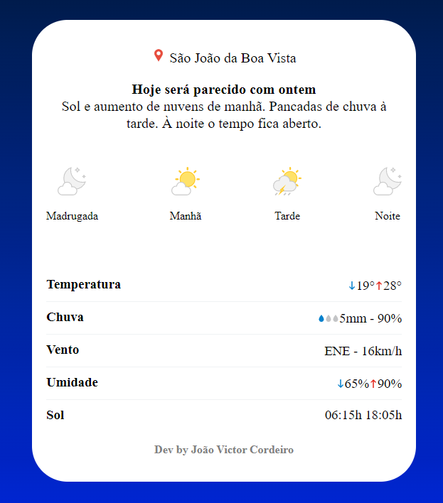

# Climate Monitor

    

Foi utilizado o conceito de webscraping para coletar as informações do site: https://www.climatempo.com.br/. A ferramenta coleta e exibe as informações da previsão do clima para o dia atual.

**Linguagem:** Python;

**Framework:** Flask;

**Objetivo:** Exibir informações climáticas;

#

**Esse App foi desenvolvido apenas para estudo e não deve ser utilizado para comercialização**